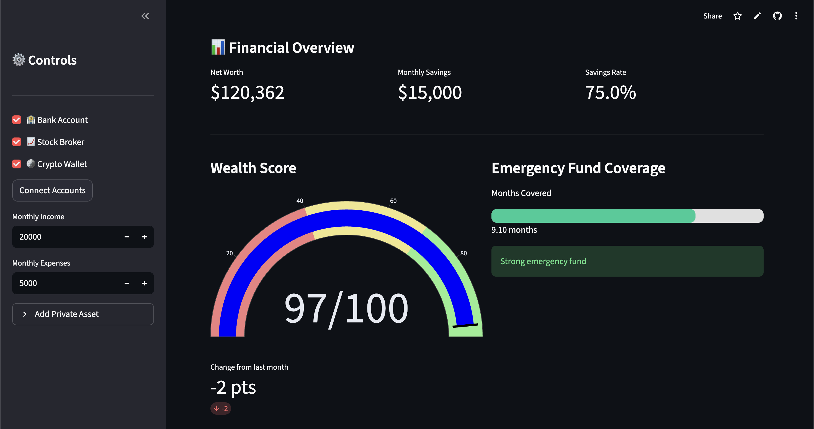
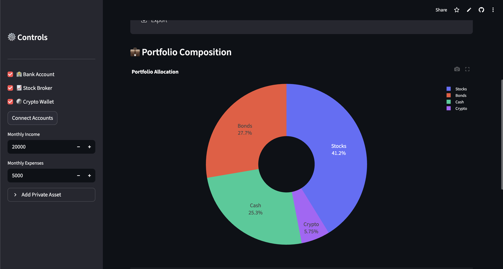
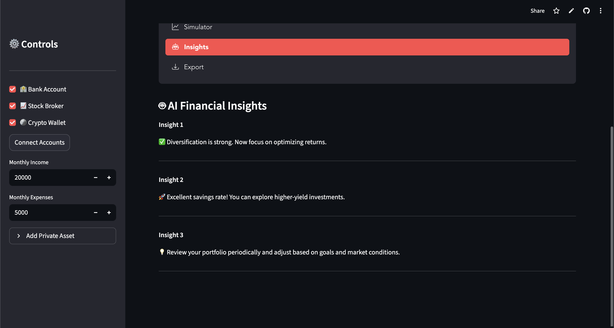
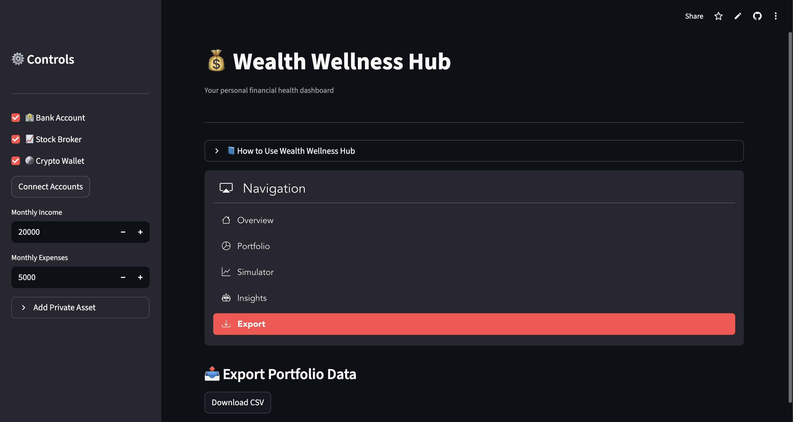

# 💰 Wealth Wellness Hub

A **personal finance dashboard** that helps users monitor, analyze, and simulate their financial health in one unified platform.

The app aggregates assets across multiple accounts, calculates a **Wealth Wellness Score**, and provides visual insights and simulations to support smarter financial decisions.

---

## 🔗 Live Demo

**App Link:** 
https://teamjanestreet-dj6sjkmhocinz289segskv.streamlit.app/

---

## 📊 Features

- 🔗 **Account Connections (Simulated)**
  - Connect bank, brokerage, and crypto accounts

- 🏠 **Private Asset Tracking**
  - Add assets like real estate, vehicles, or collectibles

- 📈 **Wealth Wellness Score**
  Composite financial health score based on:
  - **Liquidity** – emergency fund coverage measured in months of expenses
  - **Diversification** – entropy-based metric evaluating distribution across asset classes
  - **Savings Rate** – proportion of income saved after expenses
  - **Risk Adjustment** – small penalty applied if crypto holdings exceed 30% of total wealth

- 📉 **Net Worth Tracking**
  - Monitor historical changes in total wealth

- 📊 **Portfolio Visualization**
  - Interactive charts showing asset allocation

- 🎲 **Monte Carlo Wealth Simulation**
  - Forecast future wealth using randomized market scenarios
  - Inflation-adjusted projections

- 🤖 **AI-Style Financial Insights**
  - Generates portfolio recommendations and tips in an AI-like format using predefined rules.

- 📤 **CSV Export**
  - Download portfolio data for external analysis

---

## 📷 Screenshots

<<EDIT THIS: Add screenshots after you run the app>>

)

---

## 🏗️ Architecture

The application is structured into modular components:

- app.py
    - Main Streamlit dashboard interface and UI logic

- wealth_score.py
    - Computes the Wealth Wellness Score using financial metrics

- simulator.py
    - Runs Monte Carlo simulations for long-term wealth projections

- ai_insights.py
    - Generates personalized financial advice

- data_simulation.py  
    - Generates synthetic financial data to simulate historical portfolio and net worth trends

This modular structure separates **UI, analytics, and simulation logic** for maintainability and scalability.

---

## 💡 Example Use Case

A user inputs:

Income: $5000/month  
Expenses: $3000/month
Private assets: $50,000  

Assets from financial accounts:
- Cash: $10,000
- Stocks: $25,000
- Crypto: $5,000

The application will:

1. Calculate a **Wealth Wellness Score**
2. Visualize portfolio allocation
3. Track **net worth trends**
4. Run a **Monte Carlo simulation** to forecast long-term financial outcomes
5. Provide **AI-driven financial insights**

---

## ⚙️ Installation

### 1. Clone the repository
git clone https://github.com/anthonylin7604/TEAMJANESTREET.git
cd TEAMJANESTREET

### 2. Install Dependencies
pip install -r requirements.txt

### 3. Run Streamlit app
streamlit run app.py

## 🛠️ Tech Stack

- **Python**
- **Streamlit** – interactive dashboard
- **Pandas** – financial data processing
- **Plotly** – interactive visualizations
- **Monte Carlo Simulation** – probabilistic wealth forecasting

---

## 📊 Key Financial Metrics

The **Wealth Wellness Score (0–100)** evaluates overall financial health using four components:

- **Liquidity Score (40%)**  
  Measures emergency fund coverage based on how many months of expenses can be covered by cash.

- **Diversification Score (30%)**  
  Uses an entropy-based metric to evaluate how evenly wealth is distributed across asset classes.

- **Savings Score (30%)**  
  Based on the user's savings rate (income minus expenses relative to income).

- **Risk Adjustment**  
  A small penalty is applied when crypto holdings exceed 30% of total wealth to account for portfolio risk concentration.

These metrics combine into a **single composite financial health score capped at 100**.

---

## 🚀 Future Improvements

- Real bank API integrations (Plaid / Open Banking)
- Advanced portfolio optimization
- Budgeting and spending analytics
- Improved UI/UX design
- Mobile responsive interface
- Proper AI usage